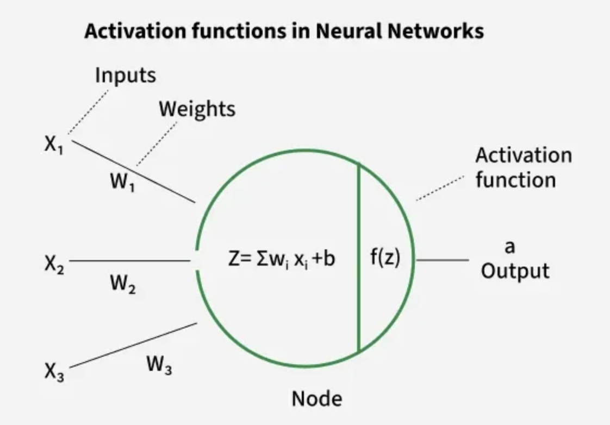

# Documentation

### Forward Flow of Activation Functions

---

Processing within a single artificial neuron follows a two-step sequence: a linear calculation followed by a non-linear activation.

**Step 1: Linear Combination (The Weighted Sum)**

The neuron first calculates the total input signal it receives. This calculation is known as the [Weighted Sum](definitions.md#weighted-sum) or **pre-activation-value**, typically denoted as $z$.

$$z = (w_1 x_1 + w_2 x_2 + \dots + w_n x_n) + b$$

It aggregates all incoming signals ($x_i$), scaled by the importance/strength of their connections (${w_i}$), and adjust it by the neuron's base threshold (${b}$).
The value $z$ is a raw, unbounded number that represents the total stimulation of the neuron.

**Step 2: Non-Linear Activation (The ReLU Function)**

The raw sum $z$ is then passed to the [ReLu Function](definitions.md#relu-rectified-linear-unit-function), which introduces the non-linearity into the network.

$$\text{Output } a = \text{ReLu}(z) = \max(0, z)$$

The $\text{ReLU}$ function act as a **decision gate** and a **non-linear filter**.

$$f(x) = \begin{cases} x & \text{if } x \geq 0 \\ 0 & \text{if } x < 0 \end{cases}$$

* If the weighted sum $z$ is **positive** ($z > 0$), the neuron is **activated**, and the output $a$ is the input value itself (${a = z}$).
* If the weighted sum $z$ is **zero or negative** ($z \leq 0$), the neuron is **silenced** for this input, and the output $a$ is ${0}$.

**Final Output**

The resulting value, $a$, is the neuron's final output, which is then passed as input to the neurons in the next layer of the neural network.
